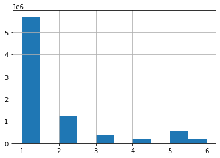
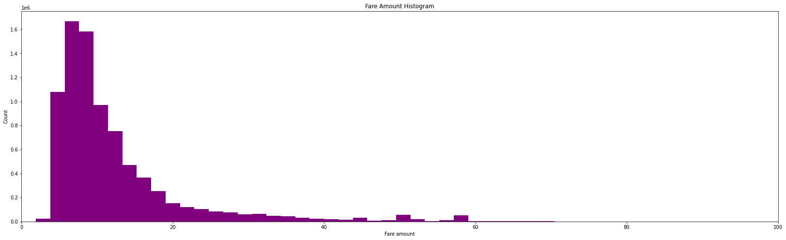
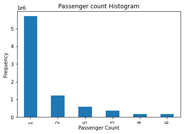
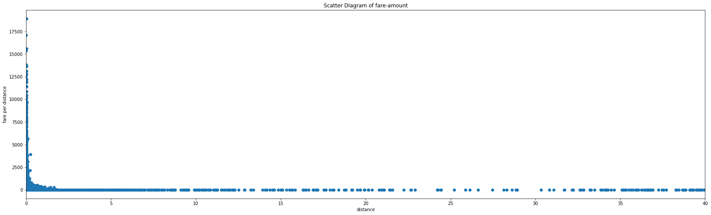
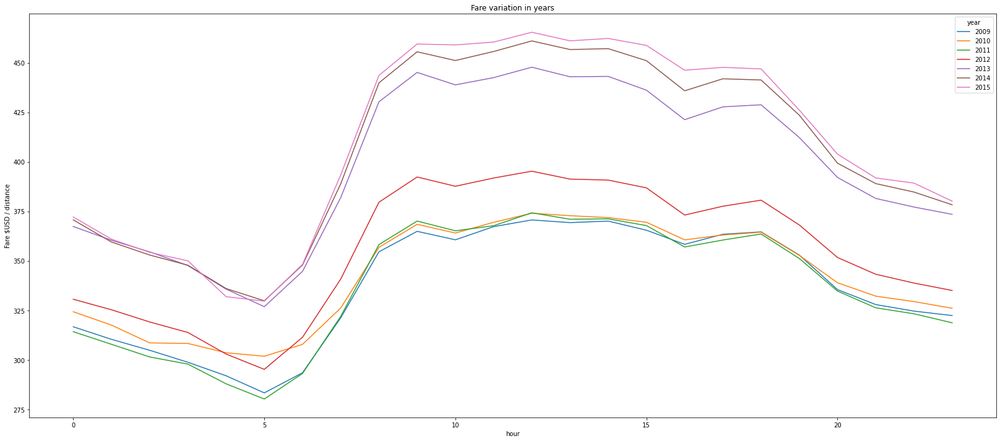

## Setting up python environment


```python
import numpy as np # pyton library for linear algebra
import pandas as pd # python library for data processing (data manipulation and analysis)
import matplotlib.pyplot as plt
import os
for dirname, _, filenames in os.walk('/kaggle/input'):
    for filename in filenames:
        print(os.path.join(dirname, filename))
```

    /kaggle/input/new-york-city-taxi-fare-prediction/GCP-Coupons-Instructions.rtf
    /kaggle/input/new-york-city-taxi-fare-prediction/train.csv
    /kaggle/input/new-york-city-taxi-fare-prediction/test.csv
    /kaggle/input/new-york-city-taxi-fare-prediction/sample_submission.csv


### Setting up training and testing data

As the training dataset is too large, we can not load whole dataset at the same time. So, we are skipping some part of the data.


```python
train_df = pd.read_csv('/kaggle/input/new-york-city-taxi-fare-prediction/train.csv', nrows = 10_000_000)
```


```python
test_df = pd.read_csv('/kaggle/input/new-york-city-taxi-fare-prediction/test.csv')
```


```python
train_df.dtypes
```


    key                   object
    fare_amount          float64
    pickup_datetime       object
    pickup_longitude     float64
    pickup_latitude      float64
    dropoff_longitude    float64
    dropoff_latitude     float64
    passenger_count        int64
    dtype: object


```python
test_df.dtypes
```


    key                   object
    pickup_datetime       object
    pickup_longitude     float64
    pickup_latitude      float64
    dropoff_longitude    float64
    dropoff_latitude     float64
    passenger_count        int64
    dtype: object


```python
# dataset shape

print('train_df: ' + str(train_df.shape))
print('test_df: ' + str(test_df.shape))
```

    train_df: (10000000, 8)
    test_df: (9914, 7)


```python
# looking some sample data

train_df.head(5)
```


<div>
<style scoped>
    .dataframe tbody tr th:only-of-type {
        vertical-align: middle;
    }

    .dataframe tbody tr th {
        vertical-align: top;
    }

    .dataframe thead th {
        text-align: right;
    }
</style>
<table border="1" class="dataframe">
  <thead>
    <tr style="text-align: right;">
      <th></th>
      <th>key</th>
      <th>fare_amount</th>
      <th>pickup_datetime</th>
      <th>pickup_longitude</th>
      <th>pickup_latitude</th>
      <th>dropoff_longitude</th>
      <th>dropoff_latitude</th>
      <th>passenger_count</th>
    </tr>
  </thead>
  <tbody>
    <tr>
      <th>0</th>
      <td>2009-06-15 17:26:21.0000001</td>
      <td>4.5</td>
      <td>2009-06-15 17:26:21 UTC</td>
      <td>-73.844311</td>
      <td>40.721319</td>
      <td>-73.841610</td>
      <td>40.712278</td>
      <td>1</td>
    </tr>
    <tr>
      <th>1</th>
      <td>2010-01-05 16:52:16.0000002</td>
      <td>16.9</td>
      <td>2010-01-05 16:52:16 UTC</td>
      <td>-74.016048</td>
      <td>40.711303</td>
      <td>-73.979268</td>
      <td>40.782004</td>
      <td>1</td>
    </tr>
    <tr>
      <th>2</th>
      <td>2011-08-18 00:35:00.00000049</td>
      <td>5.7</td>
      <td>2011-08-18 00:35:00 UTC</td>
      <td>-73.982738</td>
      <td>40.761270</td>
      <td>-73.991242</td>
      <td>40.750562</td>
      <td>2</td>
    </tr>
    <tr>
      <th>3</th>
      <td>2012-04-21 04:30:42.0000001</td>
      <td>7.7</td>
      <td>2012-04-21 04:30:42 UTC</td>
      <td>-73.987130</td>
      <td>40.733143</td>
      <td>-73.991567</td>
      <td>40.758092</td>
      <td>1</td>
    </tr>
    <tr>
      <th>4</th>
      <td>2010-03-09 07:51:00.000000135</td>
      <td>5.3</td>
      <td>2010-03-09 07:51:00 UTC</td>
      <td>-73.968095</td>
      <td>40.768008</td>
      <td>-73.956655</td>
      <td>40.783762</td>
      <td>1</td>
    </tr>
  </tbody>
</table>
</div>


```python
# describe training data

train_df.describe()
```


<div>
<style scoped>
    .dataframe tbody tr th:only-of-type {
        vertical-align: middle;
    }

    .dataframe tbody tr th {
        vertical-align: top;
    }

    .dataframe thead th {
        text-align: right;
    }
</style>
<table border="1" class="dataframe">
  <thead>
    <tr style="text-align: right;">
      <th></th>
      <th>fare_amount</th>
      <th>pickup_longitude</th>
      <th>pickup_latitude</th>
      <th>dropoff_longitude</th>
      <th>dropoff_latitude</th>
      <th>passenger_count</th>
    </tr>
  </thead>
  <tbody>
    <tr>
      <th>count</th>
      <td>1.000000e+07</td>
      <td>1.000000e+07</td>
      <td>1.000000e+07</td>
      <td>9.999931e+06</td>
      <td>9.999931e+06</td>
      <td>1.000000e+07</td>
    </tr>
    <tr>
      <th>mean</th>
      <td>1.133854e+01</td>
      <td>-7.250775e+01</td>
      <td>3.991934e+01</td>
      <td>-7.250897e+01</td>
      <td>3.991913e+01</td>
      <td>1.684793e+00</td>
    </tr>
    <tr>
      <th>std</th>
      <td>9.799930e+00</td>
      <td>1.299421e+01</td>
      <td>9.322539e+00</td>
      <td>1.287532e+01</td>
      <td>9.237280e+00</td>
      <td>1.323423e+00</td>
    </tr>
    <tr>
      <th>min</th>
      <td>-1.077500e+02</td>
      <td>-3.439245e+03</td>
      <td>-3.492264e+03</td>
      <td>-3.426601e+03</td>
      <td>-3.488080e+03</td>
      <td>0.000000e+00</td>
    </tr>
    <tr>
      <th>25%</th>
      <td>6.000000e+00</td>
      <td>-7.399207e+01</td>
      <td>4.073491e+01</td>
      <td>-7.399139e+01</td>
      <td>4.073403e+01</td>
      <td>1.000000e+00</td>
    </tr>
    <tr>
      <th>50%</th>
      <td>8.500000e+00</td>
      <td>-7.398181e+01</td>
      <td>4.075263e+01</td>
      <td>-7.398016e+01</td>
      <td>4.075316e+01</td>
      <td>1.000000e+00</td>
    </tr>
    <tr>
      <th>75%</th>
      <td>1.250000e+01</td>
      <td>-7.396710e+01</td>
      <td>4.076712e+01</td>
      <td>-7.396367e+01</td>
      <td>4.076810e+01</td>
      <td>2.000000e+00</td>
    </tr>
    <tr>
      <th>max</th>
      <td>1.273310e+03</td>
      <td>3.457626e+03</td>
      <td>3.344459e+03</td>
      <td>3.457622e+03</td>
      <td>3.351403e+03</td>
      <td>2.080000e+02</td>
    </tr>
  </tbody>
</table>
</div>


# PART 1 -> DATA CLEANSING

## Cleaning NaN / null values


```python
# count and check how many null/missing values in training data

print(train_df.isnull().sum())
```

    key                   0
    fare_amount           0
    pickup_datetime       0
    pickup_longitude      0
    pickup_latitude       0
    dropoff_longitude    69
    dropoff_latitude     69
    passenger_count       0
    dtype: int64


```python
# remove all null valued fields from the training datset

print('Training data: Previous size: ' + str(len(train_df)))
train_df = train_df.dropna(how = 'any', axis = 'rows')
print('Training data: Updated size: ' + str(len(train_df)))
```

    Training data: Previous size: 10000000
    Training data: Updated size: 9999931


## Remove negative fare amount

Fare amount can not be zero or negative. So, we can remove these fields.


```python
# check the target column first
train_df['fare_amount'].describe()
```


    count    9.999931e+06
    mean     1.133849e+01
    std      9.799845e+00
    min     -1.077500e+02
    25%      6.000000e+00
    50%      8.500000e+00
    75%      1.250000e+01
    max      1.273310e+03
    Name: fare_amount, dtype: float64


###### yes, negative values exist
# count how many negative and Zero values are here

from collections import Counter
Counter(train_df['fare_amount'] < 0) and fare can't be zero!


```python
from collections import Counter
Counter(train_df['fare_amount'] <= 0)
```


    Counter({False: 9999242, True: 689})


```python
# remove these fields from dataset
print('before: ' + str(train_df.shape))
train_df = train_df.drop(train_df[train_df['fare_amount'] <= 0].index, axis = 0)
print('after: ' + str(train_df.shape))
```

    before: (9999931, 8)
    after: (9999242, 8)


```python
# now check again

train_df['fare_amount'].describe()
```


    count    9.999242e+06
    mean     1.133966e+01
    std      9.798609e+00
    min      1.000000e-02
    25%      6.000000e+00
    50%      8.500000e+00
    75%      1.250000e+01
    max      1.273310e+03
    Name: fare_amount, dtype: float64


no more invalied fare value, yahoooo!

## Check passenger_count variable


```python
train_df['passenger_count'].describe()
```


    count    9.999242e+06
    mean     1.684807e+00
    std      1.323424e+00
    min      0.000000e+00
    25%      1.000000e+00
    50%      1.000000e+00
    75%      2.000000e+00
    max      2.080000e+02
    Name: passenger_count, dtype: float64


```python
train_df['passenger_count'].sort_values(ascending=False)
```


    2154045    208
    2910347    208
    4103745    208
    3107489    208
    7001143    208
              ... 
    2550560      0
    9688764      0
    189239       0
    6344835      0
    7974314      0
    Name: passenger_count, Length: 9999242, dtype: int64


The number of passenger must be at least one. On the other hand, a stranded size taxi can't have passengers more than 6. That is we're only keeping the rows, those have passengers [1, 6]


```python
# remove these fields from dataset
print('before: ' + str(train_df.shape))
train_df = train_df.drop(train_df[train_df['passenger_count'] <= 0].index, axis = 0) # remove numbers less or equal 0
train_df = train_df.drop(train_df[train_df['passenger_count'] > 6].index, axis = 0) # remove numbers greater or equal 0
print('after: ' + str(train_df.shape))
```

    before: (9999242, 8)
    after: (9963965, 8)


```python
train_df['passenger_count'].describe()
```


    count    9.963965e+06
    mean     1.690557e+00
    std      1.306525e+00
    min      1.000000e+00
    25%      1.000000e+00
    50%      1.000000e+00
    75%      2.000000e+00
    max      6.000000e+00
    Name: passenger_count, dtype: float64


# Feature Engineering


```python
# calculate logtitude and latitude dif and add as feature

def add_distance_dif_features(df):
    df['longitude_distance'] = abs(df['pickup_longitude'] - df['dropoff_longitude'])
    df['latitude_distance'] = abs(df['pickup_latitude'] - df['dropoff_latitude'])
    return df
    
train_df = add_distance_dif_features(train_df)
```


```python
# calculate straight distance and add as feature

def calculate_add_distance_feature(df):
    df['distance'] = (df['longitude_distance'] ** 2 + df['latitude_distance'] ** 2) ** .5
    return df
    
train_df = calculate_add_distance_feature(train_df)
```


```python
# remove unlealistic distance valued fields from dataset
# we assume unrealistic distnace which are less than 0.1 miles

def drop_unrealistic_distance(df):
    print('before: ' + str(df.shape))
    df = df.drop(df[train_df['distance'] < 0.01].index, axis = 0)
    print('after: ' + str(df.shape))
    return df
    
train_df = drop_unrealistic_distance(train_df)
```

    before: (9963965, 11)
    after: (8224381, 11)


```python
train_df.groupby('passenger_count')['distance','fare_amount'].mean()
```

    /opt/conda/lib/python3.7/site-packages/ipykernel_launcher.py:1: FutureWarning: Indexing with multiple keys (implicitly converted to a tuple of keys) will be deprecated, use a list instead.
      """Entry point for launching an IPython kernel.


<div>
<style scoped>
    .dataframe tbody tr th:only-of-type {
        vertical-align: middle;
    }

    .dataframe tbody tr th {
        vertical-align: top;
    }

    .dataframe thead th {
        text-align: right;
    }
</style>
<table border="1" class="dataframe">
  <thead>
    <tr style="text-align: right;">
      <th></th>
      <th>distance</th>
      <th>fare_amount</th>
    </tr>
    <tr>
      <th>passenger_count</th>
      <th></th>
      <th></th>
    </tr>
  </thead>
  <tbody>
    <tr>
      <th>1</th>
      <td>0.325402</td>
      <td>12.198541</td>
    </tr>
    <tr>
      <th>2</th>
      <td>0.263791</td>
      <td>12.840180</td>
    </tr>
    <tr>
      <th>3</th>
      <td>0.260806</td>
      <td>12.545002</td>
    </tr>
    <tr>
      <th>4</th>
      <td>0.307009</td>
      <td>12.743767</td>
    </tr>
    <tr>
      <th>5</th>
      <td>0.227303</td>
      <td>12.284363</td>
    </tr>
    <tr>
      <th>6</th>
      <td>0.390197</td>
      <td>13.371031</td>
    </tr>
  </tbody>
</table>
</div>


```python
print(f'average_fare: {train_df.fare_amount.sum()/train_df.distance.sum()}')
```

    average_fare: 40.19018345014175


#### Time Range of train and test dataset


```python
def print_time_range(df1, df2):
    train_df_time_start = df1.pickup_datetime.min()
    train_df_time_end = df1.pickup_datetime.max()
    print("Train Datqaset Time Starts: {}, Ends {}".format(train_df_time_start, train_df_time_end))
    
    test_df_time_start = df2.pickup_datetime.min()
    test_df_time_end = df2.pickup_datetime.max()
    print("Test Dataset Time Starts: {}, Ends {}".format(test_df_time_start, test_df_time_end))

print_time_range(train_df, test_df)
```

    Train Datqaset Time Starts: 2009-01-01 00:00:46 UTC, Ends 2015-06-30 23:59:54 UTC
    Test Dataset Time Starts: 2009-01-01 11:04:24 UTC, Ends 2015-06-30 20:03:50 UTC


### Plots and Diagrams


```python
train_df.passenger_count.hist()
```


    <matplotlib.axes._subplots.AxesSubplot at 0x7ff748370b50>





```python
plt.figure(figsize=(28,8))
plt.hist(train_df["fare_amount"], 500, facecolor="purple")
plt.xlabel("Fare amount")
plt.ylabel("Count")
plt.title("Fare Amount Histogram")
plt.xlim(0,100)
```


    (0.0, 100.0)





```python
train_df["passenger_count"].value_counts().plot.bar()
plt.title("Passenger count Histogram")
plt.xlabel("Passenger Count")
plt.ylabel("Frequency")
```


    Text(0, 0.5, 'Frequency')





```python
train_df.distance.describe()
```


    count    8.224381e+06
    mean     3.073621e-01
    std      1.539901e+01
    min      1.000000e-02
    25%      1.675648e-02
    50%      2.570094e-02
    75%      4.397095e-02
    max      7.548848e+03
    Name: distance, dtype: float64


```python
train_df["distance"].hist(figsize=(12,4))
plt.title("Histogram ride distance");
```


```python
train_df["fare_per_distance"] = train_df["fare_amount"] / train_df["distance"]
train_df["fare_per_distance"].describe()
```


    count    8.224381e+06
    mean     3.745553e+02
    std      1.526987e+02
    min      1.183805e-04
    25%      2.830627e+02
    50%      3.509738e+02
    75%      4.348068e+02
    max      1.891399e+04
    Name: fare_per_distance, dtype: float64


```python
plt.figure(figsize=(28,8))
plt.scatter(train_df["distance"], train_df["fare_per_distance"])
plt.xlabel("distance")
plt.ylabel("fare per distance")
plt.xlim(0,40)
plt.title("Scatter DIagram of fare-amount")
```


    Text(0.5, 1.0, 'Scatter DIagram of fare-amount')





```python
def add_time_features(df):
    df['pickup_datetime'] = df['pickup_datetime'].str.replace(" UTC", "")
    df['pickup_datetime'] = pd.to_datetime(df['pickup_datetime'], format='%Y-%m-%d %H:%M:%S')
    df['hour'] = df.pickup_datetime.dt.hour
    #df['week'] = df.pickup_datetime.dt.week
    df['weekday'] = df.pickup_datetime.dt.weekday
    df['month'] = df.pickup_datetime.dt.month
    df['year'] = df.pickup_datetime.dt.year
    
    return df

train_df = add_time_features(train_df)
```


```python
train_df.head()
```


<div>
<style scoped>
    .dataframe tbody tr th:only-of-type {
        vertical-align: middle;
    }

    .dataframe tbody tr th {
        vertical-align: top;
    }

    .dataframe thead th {
        text-align: right;
    }
</style>
<table border="1" class="dataframe">
  <thead>
    <tr style="text-align: right;">
      <th></th>
      <th>key</th>
      <th>fare_amount</th>
      <th>pickup_datetime</th>
      <th>pickup_longitude</th>
      <th>pickup_latitude</th>
      <th>dropoff_longitude</th>
      <th>dropoff_latitude</th>
      <th>passenger_count</th>
      <th>longitude_distance</th>
      <th>latitude_distance</th>
      <th>distance</th>
      <th>fare_per_distance</th>
      <th>hour</th>
      <th>weekday</th>
      <th>month</th>
      <th>year</th>
    </tr>
  </thead>
  <tbody>
    <tr>
      <th>1</th>
      <td>2010-01-05 16:52:16.0000002</td>
      <td>16.9</td>
      <td>2010-01-05 16:52:16</td>
      <td>-74.016048</td>
      <td>40.711303</td>
      <td>-73.979268</td>
      <td>40.782004</td>
      <td>1</td>
      <td>0.036780</td>
      <td>0.070701</td>
      <td>0.079696</td>
      <td>212.056690</td>
      <td>16</td>
      <td>1</td>
      <td>1</td>
      <td>2010</td>
    </tr>
    <tr>
      <th>2</th>
      <td>2011-08-18 00:35:00.00000049</td>
      <td>5.7</td>
      <td>2011-08-18 00:35:00</td>
      <td>-73.982738</td>
      <td>40.761270</td>
      <td>-73.991242</td>
      <td>40.750562</td>
      <td>2</td>
      <td>0.008504</td>
      <td>0.010708</td>
      <td>0.013674</td>
      <td>416.848376</td>
      <td>0</td>
      <td>3</td>
      <td>8</td>
      <td>2011</td>
    </tr>
    <tr>
      <th>3</th>
      <td>2012-04-21 04:30:42.0000001</td>
      <td>7.7</td>
      <td>2012-04-21 04:30:42</td>
      <td>-73.987130</td>
      <td>40.733143</td>
      <td>-73.991567</td>
      <td>40.758092</td>
      <td>1</td>
      <td>0.004437</td>
      <td>0.024949</td>
      <td>0.025340</td>
      <td>303.861732</td>
      <td>4</td>
      <td>5</td>
      <td>4</td>
      <td>2012</td>
    </tr>
    <tr>
      <th>4</th>
      <td>2010-03-09 07:51:00.000000135</td>
      <td>5.3</td>
      <td>2010-03-09 07:51:00</td>
      <td>-73.968095</td>
      <td>40.768008</td>
      <td>-73.956655</td>
      <td>40.783762</td>
      <td>1</td>
      <td>0.011440</td>
      <td>0.015754</td>
      <td>0.019470</td>
      <td>272.220407</td>
      <td>7</td>
      <td>1</td>
      <td>3</td>
      <td>2010</td>
    </tr>
    <tr>
      <th>5</th>
      <td>2011-01-06 09:50:45.0000002</td>
      <td>12.1</td>
      <td>2011-01-06 09:50:45</td>
      <td>-74.000964</td>
      <td>40.731630</td>
      <td>-73.972892</td>
      <td>40.758233</td>
      <td>1</td>
      <td>0.028072</td>
      <td>0.026603</td>
      <td>0.038675</td>
      <td>312.863485</td>
      <td>9</td>
      <td>3</td>
      <td>1</td>
      <td>2011</td>
    </tr>
  </tbody>
</table>
</div>


```python
#train_df['hour'] = train_df["pickup_datetime"].apply(lambda t: pd.to_datetime(t).hour)
#train_df['year'] = train_df["pickup_datetime"].apply(lambda t: pd.to_datetime(t).year)
#train_df['weekday'] = train_df["pickup_datetime"].apply(lambda t: pd.to_datetime(t).weekday())
train_df.pivot_table("fare_per_distance", index="hour", columns="year").plot(figsize=(28,12))
plt.ylabel("Fare $USD / distance");
plt.title("Fare variation in years")
```


    Text(0.5, 1.0, 'Fare variation in years')





```python
train_df.describe()
```


<div>
<style scoped>
    .dataframe tbody tr th:only-of-type {
        vertical-align: middle;
    }

    .dataframe tbody tr th {
        vertical-align: top;
    }

    .dataframe thead th {
        text-align: right;
    }
</style>
<table border="1" class="dataframe">
  <thead>
    <tr style="text-align: right;">
      <th></th>
      <th>fare_amount</th>
      <th>pickup_longitude</th>
      <th>pickup_latitude</th>
      <th>dropoff_longitude</th>
      <th>dropoff_latitude</th>
      <th>passenger_count</th>
      <th>longitude_distance</th>
      <th>latitude_distance</th>
      <th>distance</th>
      <th>fare_per_distance</th>
      <th>hour</th>
      <th>weekday</th>
      <th>month</th>
      <th>year</th>
    </tr>
  </thead>
  <tbody>
    <tr>
      <th>count</th>
      <td>8.224381e+06</td>
      <td>8.224381e+06</td>
      <td>8.224381e+06</td>
      <td>8.224381e+06</td>
      <td>8.224381e+06</td>
      <td>8.224381e+06</td>
      <td>8.224381e+06</td>
      <td>8.224381e+06</td>
      <td>8.224381e+06</td>
      <td>8.224381e+06</td>
      <td>8.224381e+06</td>
      <td>8.224381e+06</td>
      <td>8.224381e+06</td>
      <td>8.224381e+06</td>
    </tr>
    <tr>
      <th>mean</th>
      <td>1.235294e+01</td>
      <td>-7.383737e+01</td>
      <td>4.065059e+01</td>
      <td>-7.383914e+01</td>
      <td>4.065062e+01</td>
      <td>1.692171e+00</td>
      <td>2.444028e-01</td>
      <td>1.471858e-01</td>
      <td>3.073621e-01</td>
      <td>3.745553e+02</td>
      <td>1.352322e+01</td>
      <td>3.055804e+00</td>
      <td>6.278639e+00</td>
      <td>2.011753e+03</td>
    </tr>
    <tr>
      <th>std</th>
      <td>9.813382e+00</td>
      <td>8.501846e+00</td>
      <td>7.732585e+00</td>
      <td>8.247128e+00</td>
      <td>7.606393e+00</td>
      <td>1.305173e+00</td>
      <td>1.165078e+01</td>
      <td>1.006985e+01</td>
      <td>1.539901e+01</td>
      <td>1.526987e+02</td>
      <td>6.589296e+00</td>
      <td>1.953371e+00</td>
      <td>3.426042e+00</td>
      <td>1.862018e+00</td>
    </tr>
    <tr>
      <th>min</th>
      <td>1.000000e-02</td>
      <td>-3.439245e+03</td>
      <td>-3.492264e+03</td>
      <td>-3.426601e+03</td>
      <td>-3.461541e+03</td>
      <td>1.000000e+00</td>
      <td>0.000000e+00</td>
      <td>0.000000e+00</td>
      <td>1.000000e-02</td>
      <td>1.183805e-04</td>
      <td>0.000000e+00</td>
      <td>0.000000e+00</td>
      <td>1.000000e+00</td>
      <td>2.009000e+03</td>
    </tr>
    <tr>
      <th>25%</th>
      <td>6.900000e+00</td>
      <td>-7.399247e+01</td>
      <td>4.073564e+01</td>
      <td>-7.399165e+01</td>
      <td>4.073452e+01</td>
      <td>1.000000e+00</td>
      <td>8.941000e-03</td>
      <td>1.008126e-02</td>
      <td>1.675648e-02</td>
      <td>2.830627e+02</td>
      <td>9.000000e+00</td>
      <td>1.000000e+00</td>
      <td>3.000000e+00</td>
      <td>2.010000e+03</td>
    </tr>
    <tr>
      <th>50%</th>
      <td>9.300000e+00</td>
      <td>-7.398215e+01</td>
      <td>4.075286e+01</td>
      <td>-7.398037e+01</td>
      <td>4.075347e+01</td>
      <td>1.000000e+00</td>
      <td>1.542900e-02</td>
      <td>1.733300e-02</td>
      <td>2.570094e-02</td>
      <td>3.509738e+02</td>
      <td>1.400000e+01</td>
      <td>3.000000e+00</td>
      <td>6.000000e+00</td>
      <td>2.012000e+03</td>
    </tr>
    <tr>
      <th>75%</th>
      <td>1.370000e+01</td>
      <td>-7.396829e+01</td>
      <td>4.076747e+01</td>
      <td>-7.396455e+01</td>
      <td>4.076847e+01</td>
      <td>2.000000e+00</td>
      <td>2.717300e-02</td>
      <td>3.091300e-02</td>
      <td>4.397095e-02</td>
      <td>4.348068e+02</td>
      <td>1.900000e+01</td>
      <td>5.000000e+00</td>
      <td>9.000000e+00</td>
      <td>2.013000e+03</td>
    </tr>
    <tr>
      <th>max</th>
      <td>9.520000e+02</td>
      <td>3.457626e+03</td>
      <td>3.344459e+03</td>
      <td>3.457622e+03</td>
      <td>3.351403e+03</td>
      <td>6.000000e+00</td>
      <td>6.755629e+03</td>
      <td>5.501513e+03</td>
      <td>7.548848e+03</td>
      <td>1.891399e+04</td>
      <td>2.300000e+01</td>
      <td>6.000000e+00</td>
      <td>1.200000e+01</td>
      <td>2.015000e+03</td>
    </tr>
  </tbody>
</table>
</div>


```python
train_df.pivot_table("fare_per_distance", index="hour", columns="month").plot(figsize=(28,12))
plt.ylabel("Fare $USD / distance");
plt.title("Fare variation in month")
```


    Text(0.5, 1.0, 'Fare variation in month')


```python
train_df.pivot_table("fare_per_distance", index="hour", columns="weekday").plot(figsize=(28,12))
plt.ylabel("Fare $USD / distance");
plt.title("Fare variation in week days")
```


    Text(0.5, 1.0, 'Fare variation in week days')


```python
fig, axs = plt.subplots(1, 2, figsize=(32,12))
axs[0].scatter(train_df["distance"], train_df["fare_amount"], alpha=0.2)
axs[0].set_xlabel("distance")
axs[0].set_ylabel("Fare $USD")
axs[0].set_title("All Data")

idx = ((train_df['distance'] < 15) & (train_df["fare_amount"] < 100))
axs[1].scatter(train_df[idx]["distance"], train_df[idx]["fare_amount"], alpha=0.2)
axs[1].set_xlabel("distance")
axs[1].set_ylabel("Fare $USD")
axs[1].set_title("Zoom in on distance < 15  and fare < $100")
```


    Text(0.5, 1.0, 'Zoom in on distance < 15  and fare < $100')


### Train our model


```python
train_df.dtypes
```


    key                           object
    fare_amount                  float64
    pickup_datetime       datetime64[ns]
    pickup_longitude             float64
    pickup_latitude              float64
    dropoff_longitude            float64
    dropoff_latitude             float64
    passenger_count                int64
    longitude_distance           float64
    latitude_distance            float64
    distance                     float64
    fare_per_distance            float64
    hour                           int64
    weekday                        int64
    month                          int64
    year                           int64
    dtype: object


```python
train_df.shape
```


    (8224381, 16)


```python
train_df.head()
```


<div>
<style scoped>
    .dataframe tbody tr th:only-of-type {
        vertical-align: middle;
    }

    .dataframe tbody tr th {
        vertical-align: top;
    }

    .dataframe thead th {
        text-align: right;
    }
</style>
<table border="1" class="dataframe">
  <thead>
    <tr style="text-align: right;">
      <th></th>
      <th>key</th>
      <th>fare_amount</th>
      <th>pickup_datetime</th>
      <th>pickup_longitude</th>
      <th>pickup_latitude</th>
      <th>dropoff_longitude</th>
      <th>dropoff_latitude</th>
      <th>passenger_count</th>
      <th>longitude_distance</th>
      <th>latitude_distance</th>
      <th>distance</th>
      <th>fare_per_distance</th>
      <th>hour</th>
      <th>weekday</th>
      <th>month</th>
      <th>year</th>
    </tr>
  </thead>
  <tbody>
    <tr>
      <th>1</th>
      <td>2010-01-05 16:52:16.0000002</td>
      <td>16.9</td>
      <td>2010-01-05 16:52:16</td>
      <td>-74.016048</td>
      <td>40.711303</td>
      <td>-73.979268</td>
      <td>40.782004</td>
      <td>1</td>
      <td>0.036780</td>
      <td>0.070701</td>
      <td>0.079696</td>
      <td>212.056690</td>
      <td>16</td>
      <td>1</td>
      <td>1</td>
      <td>2010</td>
    </tr>
    <tr>
      <th>2</th>
      <td>2011-08-18 00:35:00.00000049</td>
      <td>5.7</td>
      <td>2011-08-18 00:35:00</td>
      <td>-73.982738</td>
      <td>40.761270</td>
      <td>-73.991242</td>
      <td>40.750562</td>
      <td>2</td>
      <td>0.008504</td>
      <td>0.010708</td>
      <td>0.013674</td>
      <td>416.848376</td>
      <td>0</td>
      <td>3</td>
      <td>8</td>
      <td>2011</td>
    </tr>
    <tr>
      <th>3</th>
      <td>2012-04-21 04:30:42.0000001</td>
      <td>7.7</td>
      <td>2012-04-21 04:30:42</td>
      <td>-73.987130</td>
      <td>40.733143</td>
      <td>-73.991567</td>
      <td>40.758092</td>
      <td>1</td>
      <td>0.004437</td>
      <td>0.024949</td>
      <td>0.025340</td>
      <td>303.861732</td>
      <td>4</td>
      <td>5</td>
      <td>4</td>
      <td>2012</td>
    </tr>
    <tr>
      <th>4</th>
      <td>2010-03-09 07:51:00.000000135</td>
      <td>5.3</td>
      <td>2010-03-09 07:51:00</td>
      <td>-73.968095</td>
      <td>40.768008</td>
      <td>-73.956655</td>
      <td>40.783762</td>
      <td>1</td>
      <td>0.011440</td>
      <td>0.015754</td>
      <td>0.019470</td>
      <td>272.220407</td>
      <td>7</td>
      <td>1</td>
      <td>3</td>
      <td>2010</td>
    </tr>
    <tr>
      <th>5</th>
      <td>2011-01-06 09:50:45.0000002</td>
      <td>12.1</td>
      <td>2011-01-06 09:50:45</td>
      <td>-74.000964</td>
      <td>40.731630</td>
      <td>-73.972892</td>
      <td>40.758233</td>
      <td>1</td>
      <td>0.028072</td>
      <td>0.026603</td>
      <td>0.038675</td>
      <td>312.863485</td>
      <td>9</td>
      <td>3</td>
      <td>1</td>
      <td>2011</td>
    </tr>
  </tbody>
</table>
</div>


Our model will take the form  X⋅w=y  where  X  is a matrix of input features, and  y  is a column of the target variable, fare_amount, for each row. The weight column  w  is what we will "learn".

First let's setup our input matrix  X  and target column  y  from our training set. The matrix  X  should consist of the two GPS coordinate differences, plus a third term of 1 to allow the model to learn a constant bias term. The column  y  should consist of the target fare_amount values.


```python
# Construct and return an Nx3 input matrix for our linear model
# using the travel vector, plus a 1.0 for a constant bias term.
def get_input_matrix(df):
    return np.column_stack((df.passenger_count, df.longitude_distance, df.latitude_distance, df.distance, df.hour, df.weekday, df.month, df.year, np.ones(len(df))))

train_X = get_input_matrix(train_df)
train_y = np.array(train_df['fare_amount'])

print(train_X.shape)
print(train_y.shape)
```

    (8224381, 9)
    (8224381,)


```python
(w, _, _, _) = np.linalg.lstsq(train_X, train_y, rcond = None)
print(w)
```

    [ 1.17226317e-01  1.56755040e-02  1.22347660e-02 -1.44528738e-02
     -3.02436198e-02 -2.22568186e-02  1.13357319e-01  7.17530547e-01
     -1.43157532e+03]


```python
w_OLS = np.matmul(np.matmul(np.linalg.inv(np.matmul(train_X.T, train_X)), train_X.T), train_y)
print(w_OLS)
```

    [ 1.17226318e-01  1.56755040e-02  1.22347660e-02 -1.44528738e-02
     -3.02436198e-02 -2.22568186e-02  1.13357319e-01  7.17530547e-01
     -1.43157532e+03]


```python
test_df = add_distance_dif_features(test_df)
test_df = calculate_add_distance_feature(test_df)
test_df = add_time_features(test_df)
test_df.head()
```


<div>
<style scoped>
    .dataframe tbody tr th:only-of-type {
        vertical-align: middle;
    }

    .dataframe tbody tr th {
        vertical-align: top;
    }

    .dataframe thead th {
        text-align: right;
    }
</style>
<table border="1" class="dataframe">
  <thead>
    <tr style="text-align: right;">
      <th></th>
      <th>key</th>
      <th>pickup_datetime</th>
      <th>pickup_longitude</th>
      <th>pickup_latitude</th>
      <th>dropoff_longitude</th>
      <th>dropoff_latitude</th>
      <th>passenger_count</th>
      <th>longitude_distance</th>
      <th>latitude_distance</th>
      <th>distance</th>
      <th>hour</th>
      <th>weekday</th>
      <th>month</th>
      <th>year</th>
    </tr>
  </thead>
  <tbody>
    <tr>
      <th>0</th>
      <td>2015-01-27 13:08:24.0000002</td>
      <td>2015-01-27 13:08:24</td>
      <td>-73.973320</td>
      <td>40.763805</td>
      <td>-73.981430</td>
      <td>40.743835</td>
      <td>1</td>
      <td>0.008110</td>
      <td>0.019970</td>
      <td>0.021554</td>
      <td>13</td>
      <td>1</td>
      <td>1</td>
      <td>2015</td>
    </tr>
    <tr>
      <th>1</th>
      <td>2015-01-27 13:08:24.0000003</td>
      <td>2015-01-27 13:08:24</td>
      <td>-73.986862</td>
      <td>40.719383</td>
      <td>-73.998886</td>
      <td>40.739201</td>
      <td>1</td>
      <td>0.012024</td>
      <td>0.019817</td>
      <td>0.023180</td>
      <td>13</td>
      <td>1</td>
      <td>1</td>
      <td>2015</td>
    </tr>
    <tr>
      <th>2</th>
      <td>2011-10-08 11:53:44.0000002</td>
      <td>2011-10-08 11:53:44</td>
      <td>-73.982524</td>
      <td>40.751260</td>
      <td>-73.979654</td>
      <td>40.746139</td>
      <td>1</td>
      <td>0.002870</td>
      <td>0.005121</td>
      <td>0.005870</td>
      <td>11</td>
      <td>5</td>
      <td>10</td>
      <td>2011</td>
    </tr>
    <tr>
      <th>3</th>
      <td>2012-12-01 21:12:12.0000002</td>
      <td>2012-12-01 21:12:12</td>
      <td>-73.981160</td>
      <td>40.767807</td>
      <td>-73.990448</td>
      <td>40.751635</td>
      <td>1</td>
      <td>0.009288</td>
      <td>0.016172</td>
      <td>0.018649</td>
      <td>21</td>
      <td>5</td>
      <td>12</td>
      <td>2012</td>
    </tr>
    <tr>
      <th>4</th>
      <td>2012-12-01 21:12:12.0000003</td>
      <td>2012-12-01 21:12:12</td>
      <td>-73.966046</td>
      <td>40.789775</td>
      <td>-73.988565</td>
      <td>40.744427</td>
      <td>1</td>
      <td>0.022519</td>
      <td>0.045348</td>
      <td>0.050631</td>
      <td>21</td>
      <td>5</td>
      <td>12</td>
      <td>2012</td>
    </tr>
  </tbody>
</table>
</div>


```python
test_X = get_input_matrix(test_df)
print(test_X.shape)
```

    (9914, 9)


```python
test_y_predictions = np.matmul(test_X, w).round(decimals = 2)
```


```python
submission = pd.DataFrame(
    {'key': test_df.key, 'fare_amount': test_y_predictions},
    columns = ['key', 'fare_amount'])
submission.to_csv('submission1.csv', index = False)

print(os.listdir('.'))
```

    ['__notebook__.ipynb', 'submission1.csv']

