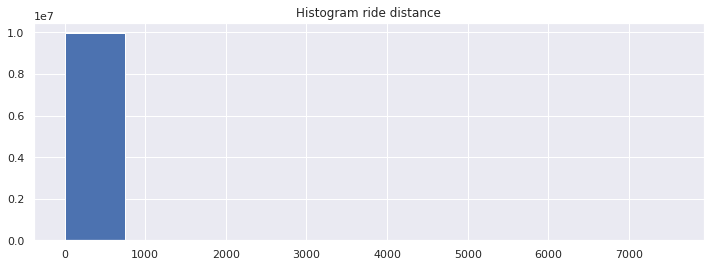

# New York City Taxi Fare Prediction


In this assignment, we will foresee the passage sum for a taxi ride in New York City, surrendered the pick, drop off areas and the date season of the get. We will begin from making an easiest model after some essential information cleaning, this straightforward model isn't Machine Learning, at that point we will move to more complex models. We should begin.

## Environment setup for python
At first, we have to import the python libraries which will be used in this project. Then we have to lead the tarin and test data. But our train data has almost 55M rows and it's quite impossible for us to use the whole dataset. That's why we'll a part of the dataset.


```python
# This Python 3 environment comes with many helpful analytics libraries installed
# It is defined by the kaggle/python Docker image: https://github.com/kaggle/docker-python
# For example, here's several helpful packages to load

import numpy as np # linear algebra
import pandas as pd # data processing, CSV file I/O (e.g. pd.read_csv)
import matplotlib.pyplot as plt # for plotting 
import seaborn as sns # high quality image
sns.set()  # use Seaborn styles
from collections import Counter
# Input data files are available in the read-only "../input/" directory
# For example, running this (by clicking run or pressing Shift+Enter) will list all files under the input directory

import os
for dirname, _, filenames in os.walk('/kaggle/input'):
    for filename in filenames:
        print(os.path.join(dirname, filename))

# You can write up to 5GB to the current directory (/kaggle/working/) that gets preserved as output when you create a version using "Save & Run All" 
# You can also write temporary files to /kaggle/temp/, but they won't be saved outside of the current session
```

    /kaggle/input/new-york-city-taxi-fare-prediction/GCP-Coupons-Instructions.rtf
    /kaggle/input/new-york-city-taxi-fare-prediction/train.csv
    /kaggle/input/new-york-city-taxi-fare-prediction/test.csv
    /kaggle/input/new-york-city-taxi-fare-prediction/sample_submission.csv


```python
#Here we're keeping out train dataset in "train_df" data frame and test dataset in "test_df" data frame.
train_df = pd.read_csv('/kaggle/input/new-york-city-taxi-fare-prediction/train.csv', nrows = 10_000_000)
test_df = pd.read_csv('/kaggle/input/new-york-city-taxi-fare-prediction/test.csv')
```

### dataset observations
Now our 1st task is to carefully observe the test and train dataset using python's built in function.

>01) At first, we're trying to find out the column's name & info of the train and test dataset


```python
train_df.head()
```


<div>
<style scoped>
    .dataframe tbody tr th:only-of-type {
        vertical-align: middle;
    }

    .dataframe tbody tr th {
        vertical-align: top;
    }

    .dataframe thead th {
        text-align: right;
    }
</style>
<table border="1" class="dataframe">
  <thead>
    <tr style="text-align: right;">
      <th></th>
      <th>key</th>
      <th>fare_amount</th>
      <th>pickup_datetime</th>
      <th>pickup_longitude</th>
      <th>pickup_latitude</th>
      <th>dropoff_longitude</th>
      <th>dropoff_latitude</th>
      <th>passenger_count</th>
    </tr>
  </thead>
  <tbody>
    <tr>
      <th>0</th>
      <td>2009-06-15 17:26:21.0000001</td>
      <td>4.5</td>
      <td>2009-06-15 17:26:21 UTC</td>
      <td>-73.844311</td>
      <td>40.721319</td>
      <td>-73.841610</td>
      <td>40.712278</td>
      <td>1</td>
    </tr>
    <tr>
      <th>1</th>
      <td>2010-01-05 16:52:16.0000002</td>
      <td>16.9</td>
      <td>2010-01-05 16:52:16 UTC</td>
      <td>-74.016048</td>
      <td>40.711303</td>
      <td>-73.979268</td>
      <td>40.782004</td>
      <td>1</td>
    </tr>
    <tr>
      <th>2</th>
      <td>2011-08-18 00:35:00.00000049</td>
      <td>5.7</td>
      <td>2011-08-18 00:35:00 UTC</td>
      <td>-73.982738</td>
      <td>40.761270</td>
      <td>-73.991242</td>
      <td>40.750562</td>
      <td>2</td>
    </tr>
    <tr>
      <th>3</th>
      <td>2012-04-21 04:30:42.0000001</td>
      <td>7.7</td>
      <td>2012-04-21 04:30:42 UTC</td>
      <td>-73.987130</td>
      <td>40.733143</td>
      <td>-73.991567</td>
      <td>40.758092</td>
      <td>1</td>
    </tr>
    <tr>
      <th>4</th>
      <td>2010-03-09 07:51:00.000000135</td>
      <td>5.3</td>
      <td>2010-03-09 07:51:00 UTC</td>
      <td>-73.968095</td>
      <td>40.768008</td>
      <td>-73.956655</td>
      <td>40.783762</td>
      <td>1</td>
    </tr>
  </tbody>
</table>
</div>


```python
test_df.head()
```


<div>
<style scoped>
    .dataframe tbody tr th:only-of-type {
        vertical-align: middle;
    }

    .dataframe tbody tr th {
        vertical-align: top;
    }

    .dataframe thead th {
        text-align: right;
    }
</style>
<table border="1" class="dataframe">
  <thead>
    <tr style="text-align: right;">
      <th></th>
      <th>key</th>
      <th>pickup_datetime</th>
      <th>pickup_longitude</th>
      <th>pickup_latitude</th>
      <th>dropoff_longitude</th>
      <th>dropoff_latitude</th>
      <th>passenger_count</th>
    </tr>
  </thead>
  <tbody>
    <tr>
      <th>0</th>
      <td>2015-01-27 13:08:24.0000002</td>
      <td>2015-01-27 13:08:24 UTC</td>
      <td>-73.973320</td>
      <td>40.763805</td>
      <td>-73.981430</td>
      <td>40.743835</td>
      <td>1</td>
    </tr>
    <tr>
      <th>1</th>
      <td>2015-01-27 13:08:24.0000003</td>
      <td>2015-01-27 13:08:24 UTC</td>
      <td>-73.986862</td>
      <td>40.719383</td>
      <td>-73.998886</td>
      <td>40.739201</td>
      <td>1</td>
    </tr>
    <tr>
      <th>2</th>
      <td>2011-10-08 11:53:44.0000002</td>
      <td>2011-10-08 11:53:44 UTC</td>
      <td>-73.982524</td>
      <td>40.751260</td>
      <td>-73.979654</td>
      <td>40.746139</td>
      <td>1</td>
    </tr>
    <tr>
      <th>3</th>
      <td>2012-12-01 21:12:12.0000002</td>
      <td>2012-12-01 21:12:12 UTC</td>
      <td>-73.981160</td>
      <td>40.767807</td>
      <td>-73.990448</td>
      <td>40.751635</td>
      <td>1</td>
    </tr>
    <tr>
      <th>4</th>
      <td>2012-12-01 21:12:12.0000003</td>
      <td>2012-12-01 21:12:12 UTC</td>
      <td>-73.966046</td>
      <td>40.789775</td>
      <td>-73.988565</td>
      <td>40.744427</td>
      <td>1</td>
    </tr>
  </tbody>
</table>
</div>


02) Now the datetype of the train and test dataset are shown


```python
train_df.dtypes
```


    key                   object
    fare_amount          float64
    pickup_datetime       object
    pickup_longitude     float64
    pickup_latitude      float64
    dropoff_longitude    float64
    dropoff_latitude     float64
    passenger_count        int64
    dtype: object


```python
test_df.dtypes
```


    key                   object
    pickup_datetime       object
    pickup_longitude     float64
    pickup_latitude      float64
    dropoff_longitude    float64
    dropoff_latitude     float64
    passenger_count        int64
    dtype: object


03) here the dimension of the dataset is shown


```python
print('train_df: ' + str(train_df.shape))
print('test_df: ' + str(test_df.shape))
```

    train_df: (10000000, 8)
    test_df: (9914, 7)


04) It's time to know some statistical information about the train and test dataset


```python
train_df.describe()
```


<div>
<style scoped>
    .dataframe tbody tr th:only-of-type {
        vertical-align: middle;
    }

    .dataframe tbody tr th {
        vertical-align: top;
    }

    .dataframe thead th {
        text-align: right;
    }
</style>
<table border="1" class="dataframe">
  <thead>
    <tr style="text-align: right;">
      <th></th>
      <th>fare_amount</th>
      <th>pickup_longitude</th>
      <th>pickup_latitude</th>
      <th>dropoff_longitude</th>
      <th>dropoff_latitude</th>
      <th>passenger_count</th>
    </tr>
  </thead>
  <tbody>
    <tr>
      <th>count</th>
      <td>1.000000e+07</td>
      <td>1.000000e+07</td>
      <td>1.000000e+07</td>
      <td>9.999931e+06</td>
      <td>9.999931e+06</td>
      <td>1.000000e+07</td>
    </tr>
    <tr>
      <th>mean</th>
      <td>1.133854e+01</td>
      <td>-7.250775e+01</td>
      <td>3.991934e+01</td>
      <td>-7.250897e+01</td>
      <td>3.991913e+01</td>
      <td>1.684793e+00</td>
    </tr>
    <tr>
      <th>std</th>
      <td>9.799930e+00</td>
      <td>1.299421e+01</td>
      <td>9.322539e+00</td>
      <td>1.287532e+01</td>
      <td>9.237280e+00</td>
      <td>1.323423e+00</td>
    </tr>
    <tr>
      <th>min</th>
      <td>-1.077500e+02</td>
      <td>-3.439245e+03</td>
      <td>-3.492264e+03</td>
      <td>-3.426601e+03</td>
      <td>-3.488080e+03</td>
      <td>0.000000e+00</td>
    </tr>
    <tr>
      <th>25%</th>
      <td>6.000000e+00</td>
      <td>-7.399207e+01</td>
      <td>4.073491e+01</td>
      <td>-7.399139e+01</td>
      <td>4.073403e+01</td>
      <td>1.000000e+00</td>
    </tr>
    <tr>
      <th>50%</th>
      <td>8.500000e+00</td>
      <td>-7.398181e+01</td>
      <td>4.075263e+01</td>
      <td>-7.398016e+01</td>
      <td>4.075316e+01</td>
      <td>1.000000e+00</td>
    </tr>
    <tr>
      <th>75%</th>
      <td>1.250000e+01</td>
      <td>-7.396710e+01</td>
      <td>4.076712e+01</td>
      <td>-7.396367e+01</td>
      <td>4.076810e+01</td>
      <td>2.000000e+00</td>
    </tr>
    <tr>
      <th>max</th>
      <td>1.273310e+03</td>
      <td>3.457626e+03</td>
      <td>3.344459e+03</td>
      <td>3.457622e+03</td>
      <td>3.351403e+03</td>
      <td>2.080000e+02</td>
    </tr>
  </tbody>
</table>
</div>


```python
test_df.describe()
```


<div>
<style scoped>
    .dataframe tbody tr th:only-of-type {
        vertical-align: middle;
    }

    .dataframe tbody tr th {
        vertical-align: top;
    }

    .dataframe thead th {
        text-align: right;
    }
</style>
<table border="1" class="dataframe">
  <thead>
    <tr style="text-align: right;">
      <th></th>
      <th>pickup_longitude</th>
      <th>pickup_latitude</th>
      <th>dropoff_longitude</th>
      <th>dropoff_latitude</th>
      <th>passenger_count</th>
    </tr>
  </thead>
  <tbody>
    <tr>
      <th>count</th>
      <td>9914.000000</td>
      <td>9914.000000</td>
      <td>9914.000000</td>
      <td>9914.000000</td>
      <td>9914.000000</td>
    </tr>
    <tr>
      <th>mean</th>
      <td>-73.974722</td>
      <td>40.751041</td>
      <td>-73.973657</td>
      <td>40.751743</td>
      <td>1.671273</td>
    </tr>
    <tr>
      <th>std</th>
      <td>0.042774</td>
      <td>0.033541</td>
      <td>0.039072</td>
      <td>0.035435</td>
      <td>1.278747</td>
    </tr>
    <tr>
      <th>min</th>
      <td>-74.252193</td>
      <td>40.573143</td>
      <td>-74.263242</td>
      <td>40.568973</td>
      <td>1.000000</td>
    </tr>
    <tr>
      <th>25%</th>
      <td>-73.992501</td>
      <td>40.736125</td>
      <td>-73.991247</td>
      <td>40.735254</td>
      <td>1.000000</td>
    </tr>
    <tr>
      <th>50%</th>
      <td>-73.982326</td>
      <td>40.753051</td>
      <td>-73.980015</td>
      <td>40.754065</td>
      <td>1.000000</td>
    </tr>
    <tr>
      <th>75%</th>
      <td>-73.968013</td>
      <td>40.767113</td>
      <td>-73.964059</td>
      <td>40.768757</td>
      <td>2.000000</td>
    </tr>
    <tr>
      <th>max</th>
      <td>-72.986532</td>
      <td>41.709555</td>
      <td>-72.990963</td>
      <td>41.696683</td>
      <td>6.000000</td>
    </tr>
  </tbody>
</table>
</div>


## Data cleaning
In Machine Learning world data cleaning is the most important part of ML project. We on avg spend 85% of time on cleaning dataset because our ML model's result is going to extremely depends on data cleaning.
##### Data cleaning will be applied on train data only

01) Missig values: At first, we are going to resolve the missing values. Since out train dataset is huge so we're not going to generate missing value. We'll drop the missing rows.


```python
print(train_df.isnull().sum())
```

    key                   0
    fare_amount           0
    pickup_datetime       0
    pickup_longitude      0
    pickup_latitude       0
    dropoff_longitude    69
    dropoff_latitude     69
    passenger_count       0
    dtype: int64


```python
print('Old size: %d' % len(train_df))
train_df = train_df.dropna(how = 'any', axis = 'rows')
print('New size: %d' % len(train_df))
```

    Old size: 10000000
    New size: 9999931


```python
print(train_df.isnull().sum())
```

    key                  0
    fare_amount          0
    pickup_datetime      0
    pickup_longitude     0
    pickup_latitude      0
    dropoff_longitude    0
    dropoff_latitude     0
    passenger_count      0
    dtype: int64


02) Valied fare: A valied fare is always positive number. So we have to remove the fare which are less than or equal to Zero.


```python
# count how many negative and Zero values are here
Counter(train_df['fare_amount'] <= 0)
```


    Counter({False: 9999242, True: 689})


```python
train_df['fare_amount'].describe()
```


    count    9.999931e+06
    mean     1.133849e+01
    std      9.799845e+00
    min     -1.077500e+02
    25%      6.000000e+00
    50%      8.500000e+00
    75%      1.250000e+01
    max      1.273310e+03
    Name: fare_amount, dtype: float64


```python
print('before: ' + str(train_df.shape))
train_df = train_df.drop(train_df[train_df['fare_amount'] <= 0].index, axis = 0)
print('after: ' + str(train_df.shape))
```

    before: (9999931, 8)
    after: (9999242, 8)


```python
train_df['fare_amount'].describe()
```


    count    9.999242e+06
    mean     1.133966e+01
    std      9.798609e+00
    min      1.000000e-02
    25%      6.000000e+00
    50%      8.500000e+00
    75%      1.250000e+01
    max      1.273310e+03
    Name: fare_amount, dtype: float64


03) passenger_count: This value is always greater than or equal to one. On the other hand, a standard size taxi can carry max 6 people. So we are assuming that a valied passenger_count is greater tnan equal to One and less than or equal to Six.


```python
train_df['passenger_count'].describe()
```


    count    9.999242e+06
    mean     1.684807e+00
    std      1.323424e+00
    min      0.000000e+00
    25%      1.000000e+00
    50%      1.000000e+00
    75%      2.000000e+00
    max      2.080000e+02
    Name: passenger_count, dtype: float64


```python
print('before: ' + str(train_df.shape))
train_df = train_df.drop(train_df[train_df['passenger_count'] <= 0].index, axis = 0) # remove numbers less or equal 0
train_df = train_df.drop(train_df[train_df['passenger_count'] > 6].index, axis = 0) # remove numbers greater or equal 0
print('after: ' + str(train_df.shape))
```

    before: (9999242, 8)
    after: (9963965, 8)


```python
train_df['passenger_count'].describe()
```


    count    9.963965e+06
    mean     1.690557e+00
    std      1.306525e+00
    min      1.000000e+00
    25%      1.000000e+00
    50%      1.000000e+00
    75%      2.000000e+00
    max      6.000000e+00
    Name: passenger_count, dtype: float64


## Feature Engineering

01) Time: Taxi fare heavily depends on time. For example: in holydays, people do visit a lot. On the other hand during reany season people hardy go outside. Moreover, in the mid night people don't go outside without important reason. On the other hand, people go outside during festival eg: xmas days. So time plays an important role in taxi fare. That's why we'll do categories the data base on time(hour, weekday, month, year).


```python
def add_time_features(df):
    df['pickup_datetime'] = df['pickup_datetime'].str.replace(" UTC", "")
    df['pickup_datetime'] = pd.to_datetime(df['pickup_datetime'], format='%Y-%m-%d %H:%M:%S')
    df['hour'] = df.pickup_datetime.dt.hour
    #df['week'] = df.pickup_datetime.dt.week
    df['weekday'] = df.pickup_datetime.dt.weekday
    df['month'] = df.pickup_datetime.dt.month
    df['year'] = df.pickup_datetime.dt.year
    
    return df
```


```python
train_df = add_time_features(train_df) # adding some columns to train dataset
```


```python
train_df.head()
```


<div>
<style scoped>
    .dataframe tbody tr th:only-of-type {
        vertical-align: middle;
    }

    .dataframe tbody tr th {
        vertical-align: top;
    }

    .dataframe thead th {
        text-align: right;
    }
</style>
<table border="1" class="dataframe">
  <thead>
    <tr style="text-align: right;">
      <th></th>
      <th>key</th>
      <th>fare_amount</th>
      <th>pickup_datetime</th>
      <th>pickup_longitude</th>
      <th>pickup_latitude</th>
      <th>dropoff_longitude</th>
      <th>dropoff_latitude</th>
      <th>passenger_count</th>
      <th>hour</th>
      <th>weekday</th>
      <th>month</th>
      <th>year</th>
    </tr>
  </thead>
  <tbody>
    <tr>
      <th>0</th>
      <td>2009-06-15 17:26:21.0000001</td>
      <td>4.5</td>
      <td>2009-06-15 17:26:21</td>
      <td>-73.844311</td>
      <td>40.721319</td>
      <td>-73.841610</td>
      <td>40.712278</td>
      <td>1</td>
      <td>17</td>
      <td>0</td>
      <td>6</td>
      <td>2009</td>
    </tr>
    <tr>
      <th>1</th>
      <td>2010-01-05 16:52:16.0000002</td>
      <td>16.9</td>
      <td>2010-01-05 16:52:16</td>
      <td>-74.016048</td>
      <td>40.711303</td>
      <td>-73.979268</td>
      <td>40.782004</td>
      <td>1</td>
      <td>16</td>
      <td>1</td>
      <td>1</td>
      <td>2010</td>
    </tr>
    <tr>
      <th>2</th>
      <td>2011-08-18 00:35:00.00000049</td>
      <td>5.7</td>
      <td>2011-08-18 00:35:00</td>
      <td>-73.982738</td>
      <td>40.761270</td>
      <td>-73.991242</td>
      <td>40.750562</td>
      <td>2</td>
      <td>0</td>
      <td>3</td>
      <td>8</td>
      <td>2011</td>
    </tr>
    <tr>
      <th>3</th>
      <td>2012-04-21 04:30:42.0000001</td>
      <td>7.7</td>
      <td>2012-04-21 04:30:42</td>
      <td>-73.987130</td>
      <td>40.733143</td>
      <td>-73.991567</td>
      <td>40.758092</td>
      <td>1</td>
      <td>4</td>
      <td>5</td>
      <td>4</td>
      <td>2012</td>
    </tr>
    <tr>
      <th>4</th>
      <td>2010-03-09 07:51:00.000000135</td>
      <td>5.3</td>
      <td>2010-03-09 07:51:00</td>
      <td>-73.968095</td>
      <td>40.768008</td>
      <td>-73.956655</td>
      <td>40.783762</td>
      <td>1</td>
      <td>7</td>
      <td>1</td>
      <td>3</td>
      <td>2010</td>
    </tr>
  </tbody>
</table>
</div>


02) Location: Let's build two new features in our training set that represent the "travel vector" in both longitude and latitude coordinates between the start and end points of the taxi trip. As we're just interested in the distance travelled, we'll take the absolute value. Using a helper feature so later on we may want to do the same thing with the test collection.


```python
def add_travel_vector_features(df):
    df['abs_diff_longitude'] = (df.dropoff_longitude - df.pickup_longitude).abs()
    df['abs_diff_latitude'] = (df.dropoff_latitude - df.pickup_latitude).abs()

```


```python
add_travel_vector_features(train_df)
```


```python
# calculate straight distance and add as feature

def calculate_add_distance_feature(df):
    df['distance'] = (df['abs_diff_longitude'] ** 2 + df['abs_diff_latitude'] ** 2) ** .5
    return df
    
train_df = calculate_add_distance_feature(train_df)

```


```python
train_df["distance"].hist(figsize=(12,4))
plt.title("Histogram ride distance");
```





```python
train_df['distance'].describe()
```


    count    9.963965e+06
    mean     2.547027e-01
    std      1.399081e+01
    min      0.000000e+00
    25%      1.239305e-02
    50%      2.143539e-02
    75%      3.835107e-02
    max      7.548848e+03
    Name: distance, dtype: float64


We expect most of these values to be very small (likely between 0 and 1) since it should all be differences between GPS coordinates within one city. For reference, one degree of latitude is about 69 miles. However, we can see the dataset has extreme values which do not make sense. Let's remove those values from our training set. Based on the scatterplot, it looks like we can safely exclude values above 5 (though remember the scatterplot is only showing the first 2000 rows...)


```python
print('Old size: %d' % len(train_df))
train_df = train_df[(train_df.abs_diff_longitude < 5.0) & (train_df.abs_diff_latitude < 5.0)]
print('New size: %d' % len(train_df))
```

    Old size: 9963965
    New size: 9943523


```python
train_df.head()
```


<div>
<style scoped>
    .dataframe tbody tr th:only-of-type {
        vertical-align: middle;
    }

    .dataframe tbody tr th {
        vertical-align: top;
    }

    .dataframe thead th {
        text-align: right;
    }
</style>
<table border="1" class="dataframe">
  <thead>
    <tr style="text-align: right;">
      <th></th>
      <th>key</th>
      <th>fare_amount</th>
      <th>pickup_datetime</th>
      <th>pickup_longitude</th>
      <th>pickup_latitude</th>
      <th>dropoff_longitude</th>
      <th>dropoff_latitude</th>
      <th>passenger_count</th>
      <th>hour</th>
      <th>weekday</th>
      <th>month</th>
      <th>year</th>
      <th>abs_diff_longitude</th>
      <th>abs_diff_latitude</th>
      <th>distance</th>
    </tr>
  </thead>
  <tbody>
    <tr>
      <th>0</th>
      <td>2009-06-15 17:26:21.0000001</td>
      <td>4.5</td>
      <td>2009-06-15 17:26:21</td>
      <td>-73.844311</td>
      <td>40.721319</td>
      <td>-73.841610</td>
      <td>40.712278</td>
      <td>1</td>
      <td>17</td>
      <td>0</td>
      <td>6</td>
      <td>2009</td>
      <td>0.002701</td>
      <td>0.009041</td>
      <td>0.009436</td>
    </tr>
    <tr>
      <th>1</th>
      <td>2010-01-05 16:52:16.0000002</td>
      <td>16.9</td>
      <td>2010-01-05 16:52:16</td>
      <td>-74.016048</td>
      <td>40.711303</td>
      <td>-73.979268</td>
      <td>40.782004</td>
      <td>1</td>
      <td>16</td>
      <td>1</td>
      <td>1</td>
      <td>2010</td>
      <td>0.036780</td>
      <td>0.070701</td>
      <td>0.079696</td>
    </tr>
    <tr>
      <th>2</th>
      <td>2011-08-18 00:35:00.00000049</td>
      <td>5.7</td>
      <td>2011-08-18 00:35:00</td>
      <td>-73.982738</td>
      <td>40.761270</td>
      <td>-73.991242</td>
      <td>40.750562</td>
      <td>2</td>
      <td>0</td>
      <td>3</td>
      <td>8</td>
      <td>2011</td>
      <td>0.008504</td>
      <td>0.010708</td>
      <td>0.013674</td>
    </tr>
    <tr>
      <th>3</th>
      <td>2012-04-21 04:30:42.0000001</td>
      <td>7.7</td>
      <td>2012-04-21 04:30:42</td>
      <td>-73.987130</td>
      <td>40.733143</td>
      <td>-73.991567</td>
      <td>40.758092</td>
      <td>1</td>
      <td>4</td>
      <td>5</td>
      <td>4</td>
      <td>2012</td>
      <td>0.004437</td>
      <td>0.024949</td>
      <td>0.025340</td>
    </tr>
    <tr>
      <th>4</th>
      <td>2010-03-09 07:51:00.000000135</td>
      <td>5.3</td>
      <td>2010-03-09 07:51:00</td>
      <td>-73.968095</td>
      <td>40.768008</td>
      <td>-73.956655</td>
      <td>40.783762</td>
      <td>1</td>
      <td>7</td>
      <td>1</td>
      <td>3</td>
      <td>2010</td>
      <td>0.011440</td>
      <td>0.015754</td>
      <td>0.019470</td>
    </tr>
  </tbody>
</table>
</div>


```python
train_df.describe()
```


<div>
<style scoped>
    .dataframe tbody tr th:only-of-type {
        vertical-align: middle;
    }

    .dataframe tbody tr th {
        vertical-align: top;
    }

    .dataframe thead th {
        text-align: right;
    }
</style>
<table border="1" class="dataframe">
  <thead>
    <tr style="text-align: right;">
      <th></th>
      <th>fare_amount</th>
      <th>pickup_longitude</th>
      <th>pickup_latitude</th>
      <th>dropoff_longitude</th>
      <th>dropoff_latitude</th>
      <th>passenger_count</th>
      <th>hour</th>
      <th>weekday</th>
      <th>month</th>
      <th>year</th>
      <th>abs_diff_longitude</th>
      <th>abs_diff_latitude</th>
      <th>distance</th>
    </tr>
  </thead>
  <tbody>
    <tr>
      <th>count</th>
      <td>9.943523e+06</td>
      <td>9.943523e+06</td>
      <td>9.943523e+06</td>
      <td>9.943523e+06</td>
      <td>9.943523e+06</td>
      <td>9.943523e+06</td>
      <td>9.943523e+06</td>
      <td>9.943523e+06</td>
      <td>9.943523e+06</td>
      <td>9.943523e+06</td>
      <td>9.943523e+06</td>
      <td>9.943523e+06</td>
      <td>9.943523e+06</td>
    </tr>
    <tr>
      <th>mean</th>
      <td>1.134003e+01</td>
      <td>-7.256882e+01</td>
      <td>3.995091e+01</td>
      <td>-7.256796e+01</td>
      <td>3.995125e+01</td>
      <td>1.690605e+00</td>
      <td>1.351120e+01</td>
      <td>3.041393e+00</td>
      <td>6.267350e+00</td>
      <td>2.011739e+03</td>
      <td>2.251546e-02</td>
      <td>2.111498e-02</td>
      <td>3.377464e-02</td>
    </tr>
    <tr>
      <th>std</th>
      <td>9.780789e+00</td>
      <td>1.075765e+01</td>
      <td>6.592764e+00</td>
      <td>1.075754e+01</td>
      <td>6.592813e+00</td>
      <td>1.306535e+00</td>
      <td>6.517226e+00</td>
      <td>1.949076e+00</td>
      <td>3.434898e+00</td>
      <td>1.862968e+00</td>
      <td>3.854393e-02</td>
      <td>2.896195e-02</td>
      <td>4.622220e-02</td>
    </tr>
    <tr>
      <th>min</th>
      <td>1.000000e-02</td>
      <td>-3.348349e+03</td>
      <td>-3.488080e+03</td>
      <td>-3.348349e+03</td>
      <td>-3.488080e+03</td>
      <td>1.000000e+00</td>
      <td>0.000000e+00</td>
      <td>0.000000e+00</td>
      <td>1.000000e+00</td>
      <td>2.009000e+03</td>
      <td>0.000000e+00</td>
      <td>0.000000e+00</td>
      <td>0.000000e+00</td>
    </tr>
    <tr>
      <th>25%</th>
      <td>6.000000e+00</td>
      <td>-7.399209e+01</td>
      <td>4.073497e+01</td>
      <td>-7.399140e+01</td>
      <td>4.073409e+01</td>
      <td>1.000000e+00</td>
      <td>9.000000e+00</td>
      <td>1.000000e+00</td>
      <td>3.000000e+00</td>
      <td>2.010000e+03</td>
      <td>5.790000e-03</td>
      <td>6.575000e-03</td>
      <td>1.237743e-02</td>
    </tr>
    <tr>
      <th>50%</th>
      <td>8.500000e+00</td>
      <td>-7.398183e+01</td>
      <td>4.075266e+01</td>
      <td>-7.398018e+01</td>
      <td>4.075318e+01</td>
      <td>1.000000e+00</td>
      <td>1.400000e+01</td>
      <td>3.000000e+00</td>
      <td>6.000000e+00</td>
      <td>2.012000e+03</td>
      <td>1.240000e-02</td>
      <td>1.383000e-02</td>
      <td>2.139010e-02</td>
    </tr>
    <tr>
      <th>75%</th>
      <td>1.250000e+01</td>
      <td>-7.396717e+01</td>
      <td>4.076714e+01</td>
      <td>-7.396375e+01</td>
      <td>4.076812e+01</td>
      <td>2.000000e+00</td>
      <td>1.900000e+01</td>
      <td>5.000000e+00</td>
      <td>9.000000e+00</td>
      <td>2.013000e+03</td>
      <td>2.359900e-02</td>
      <td>2.682700e-02</td>
      <td>3.817623e-02</td>
    </tr>
    <tr>
      <th>max</th>
      <td>1.273310e+03</td>
      <td>3.442185e+03</td>
      <td>2.973980e+03</td>
      <td>3.442185e+03</td>
      <td>2.973980e+03</td>
      <td>6.000000e+00</td>
      <td>2.300000e+01</td>
      <td>6.000000e+00</td>
      <td>1.200000e+01</td>
      <td>2.015000e+03</td>
      <td>4.975685e+00</td>
      <td>4.991325e+00</td>
      <td>6.315736e+00</td>
    </tr>
  </tbody>
</table>
</div>


## data visualization
<i>a picture is worth a thousand words</i><br>
In this part well do plot the data so that we can see the real picture. This will give us clear idea about the dataset and problem as well.


```python
train_df.passenger_count.hist()
```


    <matplotlib.axes._subplots.AxesSubplot at 0x7f1a5585b790>


```python
plt.figure(figsize=(28,8))
plt.hist(train_df["fare_amount"], 500, facecolor="purple")
plt.xlabel("Fare amount")
plt.ylabel("Count")
plt.title("Fare Amount Histogram")
plt.xlim(0,100)

```


    (0.0, 100.0)


```python
train_df["passenger_count"].value_counts().plot.bar()
plt.title("Passenger count Histogram")
plt.xlabel("Passenger Count")
plt.ylabel("Frequency")

```


    Text(0, 0.5, 'Frequency')


```python
def drop_unrealistic_distance(df):
    print('before: ' + str(df.shape))
    df = df.drop(df[train_df['distance'] < 0.01].index, axis = 0)
    print('after: ' + str(df.shape))
    return df
    
train_df = drop_unrealistic_distance(train_df)

```

    before: (9943523, 15)
    after: (8203939, 15)


```python
train_df["fare_per_distance"] = train_df["fare_amount"] / train_df["distance"]
train_df["fare_per_distance"].describe()
```


    count    8.203939e+06
    mean     3.754881e+02
    std      1.517397e+02
    min      4.715623e-02
    25%      2.835819e+02
    50%      3.513208e+02
    75%      4.350787e+02
    max      1.891399e+04
    Name: fare_per_distance, dtype: float64


```python
plt.figure(figsize=(28,8))
plt.scatter(train_df["distance"], train_df["fare_per_distance"])
plt.xlabel("distance")
plt.ylabel("fare per distance")
plt.xlim(0,40)
plt.title("Scatter DIagram of fare-amount")
```


    Text(0.5, 1.0, 'Scatter DIagram of fare-amount')


```python
train_df.head()
```


<div>
<style scoped>
    .dataframe tbody tr th:only-of-type {
        vertical-align: middle;
    }

    .dataframe tbody tr th {
        vertical-align: top;
    }

    .dataframe thead th {
        text-align: right;
    }
</style>
<table border="1" class="dataframe">
  <thead>
    <tr style="text-align: right;">
      <th></th>
      <th>key</th>
      <th>fare_amount</th>
      <th>pickup_datetime</th>
      <th>pickup_longitude</th>
      <th>pickup_latitude</th>
      <th>dropoff_longitude</th>
      <th>dropoff_latitude</th>
      <th>passenger_count</th>
      <th>hour</th>
      <th>weekday</th>
      <th>month</th>
      <th>year</th>
      <th>abs_diff_longitude</th>
      <th>abs_diff_latitude</th>
      <th>distance</th>
      <th>fare_per_distance</th>
    </tr>
  </thead>
  <tbody>
    <tr>
      <th>1</th>
      <td>2010-01-05 16:52:16.0000002</td>
      <td>16.9</td>
      <td>2010-01-05 16:52:16</td>
      <td>-74.016048</td>
      <td>40.711303</td>
      <td>-73.979268</td>
      <td>40.782004</td>
      <td>1</td>
      <td>16</td>
      <td>1</td>
      <td>1</td>
      <td>2010</td>
      <td>0.036780</td>
      <td>0.070701</td>
      <td>0.079696</td>
      <td>212.056690</td>
    </tr>
    <tr>
      <th>2</th>
      <td>2011-08-18 00:35:00.00000049</td>
      <td>5.7</td>
      <td>2011-08-18 00:35:00</td>
      <td>-73.982738</td>
      <td>40.761270</td>
      <td>-73.991242</td>
      <td>40.750562</td>
      <td>2</td>
      <td>0</td>
      <td>3</td>
      <td>8</td>
      <td>2011</td>
      <td>0.008504</td>
      <td>0.010708</td>
      <td>0.013674</td>
      <td>416.848376</td>
    </tr>
    <tr>
      <th>3</th>
      <td>2012-04-21 04:30:42.0000001</td>
      <td>7.7</td>
      <td>2012-04-21 04:30:42</td>
      <td>-73.987130</td>
      <td>40.733143</td>
      <td>-73.991567</td>
      <td>40.758092</td>
      <td>1</td>
      <td>4</td>
      <td>5</td>
      <td>4</td>
      <td>2012</td>
      <td>0.004437</td>
      <td>0.024949</td>
      <td>0.025340</td>
      <td>303.861732</td>
    </tr>
    <tr>
      <th>4</th>
      <td>2010-03-09 07:51:00.000000135</td>
      <td>5.3</td>
      <td>2010-03-09 07:51:00</td>
      <td>-73.968095</td>
      <td>40.768008</td>
      <td>-73.956655</td>
      <td>40.783762</td>
      <td>1</td>
      <td>7</td>
      <td>1</td>
      <td>3</td>
      <td>2010</td>
      <td>0.011440</td>
      <td>0.015754</td>
      <td>0.019470</td>
      <td>272.220407</td>
    </tr>
    <tr>
      <th>5</th>
      <td>2011-01-06 09:50:45.0000002</td>
      <td>12.1</td>
      <td>2011-01-06 09:50:45</td>
      <td>-74.000964</td>
      <td>40.731630</td>
      <td>-73.972892</td>
      <td>40.758233</td>
      <td>1</td>
      <td>9</td>
      <td>3</td>
      <td>1</td>
      <td>2011</td>
      <td>0.028072</td>
      <td>0.026603</td>
      <td>0.038675</td>
      <td>312.863485</td>
    </tr>
  </tbody>
</table>
</div>


```python
train_df.pivot_table('fare_per_distance', index='hour', columns='year').plot(figsize=(28,12))
plt.ylabel("Fare $USD / distance");
plt.title("Fare variation in years")
```


    Text(0.5, 1.0, 'Fare variation in years')


```python
train_df.pivot_table("fare_per_distance", index="hour", columns="month").plot(figsize=(28,12))
plt.ylabel("Fare $USD / distance");
plt.title("Fare variation in month")
```


    Text(0.5, 1.0, 'Fare variation in month')


```python
train_df.pivot_table("fare_per_distance", index="hour", columns="weekday").plot(figsize=(28,12))
plt.ylabel("Fare $USD / distance");
plt.title("Fare variation in week days")
```


    Text(0.5, 1.0, 'Fare variation in week days')


```python
fig, axs = plt.subplots(1, 2, figsize=(32,12))
axs[0].scatter(train_df["distance"], train_df["fare_amount"], alpha=0.2)
axs[0].set_xlabel("distance")
axs[0].set_ylabel("Fare $USD")
axs[0].set_title("All Data")

idx = ((train_df['distance'] < 15) & (train_df["fare_amount"] < 100))
axs[1].scatter(train_df[idx]["distance"], train_df[idx]["fare_amount"], alpha=0.2)
axs[1].set_xlabel("distance")
axs[1].set_ylabel("Fare $USD")
axs[1].set_title("Zoom in on distance < 15  and fare < $100")
```


    Text(0.5, 1.0, 'Zoom in on distance < 15  and fare < $100')


## Train our model


```python
train_df.dtypes
```


    key                           object
    fare_amount                  float64
    pickup_datetime       datetime64[ns]
    pickup_longitude             float64
    pickup_latitude              float64
    dropoff_longitude            float64
    dropoff_latitude             float64
    passenger_count                int64
    hour                           int64
    weekday                        int64
    month                          int64
    year                           int64
    abs_diff_longitude           float64
    abs_diff_latitude            float64
    distance                     float64
    fare_per_distance            float64
    dtype: object


```python
train_df.shape
```


    (8203939, 16)


```python
train_df.head()
```


<div>
<style scoped>
    .dataframe tbody tr th:only-of-type {
        vertical-align: middle;
    }

    .dataframe tbody tr th {
        vertical-align: top;
    }

    .dataframe thead th {
        text-align: right;
    }
</style>
<table border="1" class="dataframe">
  <thead>
    <tr style="text-align: right;">
      <th></th>
      <th>key</th>
      <th>fare_amount</th>
      <th>pickup_datetime</th>
      <th>pickup_longitude</th>
      <th>pickup_latitude</th>
      <th>dropoff_longitude</th>
      <th>dropoff_latitude</th>
      <th>passenger_count</th>
      <th>hour</th>
      <th>weekday</th>
      <th>month</th>
      <th>year</th>
      <th>abs_diff_longitude</th>
      <th>abs_diff_latitude</th>
      <th>distance</th>
      <th>fare_per_distance</th>
    </tr>
  </thead>
  <tbody>
    <tr>
      <th>1</th>
      <td>2010-01-05 16:52:16.0000002</td>
      <td>16.9</td>
      <td>2010-01-05 16:52:16</td>
      <td>-74.016048</td>
      <td>40.711303</td>
      <td>-73.979268</td>
      <td>40.782004</td>
      <td>1</td>
      <td>16</td>
      <td>1</td>
      <td>1</td>
      <td>2010</td>
      <td>0.036780</td>
      <td>0.070701</td>
      <td>0.079696</td>
      <td>212.056690</td>
    </tr>
    <tr>
      <th>2</th>
      <td>2011-08-18 00:35:00.00000049</td>
      <td>5.7</td>
      <td>2011-08-18 00:35:00</td>
      <td>-73.982738</td>
      <td>40.761270</td>
      <td>-73.991242</td>
      <td>40.750562</td>
      <td>2</td>
      <td>0</td>
      <td>3</td>
      <td>8</td>
      <td>2011</td>
      <td>0.008504</td>
      <td>0.010708</td>
      <td>0.013674</td>
      <td>416.848376</td>
    </tr>
    <tr>
      <th>3</th>
      <td>2012-04-21 04:30:42.0000001</td>
      <td>7.7</td>
      <td>2012-04-21 04:30:42</td>
      <td>-73.987130</td>
      <td>40.733143</td>
      <td>-73.991567</td>
      <td>40.758092</td>
      <td>1</td>
      <td>4</td>
      <td>5</td>
      <td>4</td>
      <td>2012</td>
      <td>0.004437</td>
      <td>0.024949</td>
      <td>0.025340</td>
      <td>303.861732</td>
    </tr>
    <tr>
      <th>4</th>
      <td>2010-03-09 07:51:00.000000135</td>
      <td>5.3</td>
      <td>2010-03-09 07:51:00</td>
      <td>-73.968095</td>
      <td>40.768008</td>
      <td>-73.956655</td>
      <td>40.783762</td>
      <td>1</td>
      <td>7</td>
      <td>1</td>
      <td>3</td>
      <td>2010</td>
      <td>0.011440</td>
      <td>0.015754</td>
      <td>0.019470</td>
      <td>272.220407</td>
    </tr>
    <tr>
      <th>5</th>
      <td>2011-01-06 09:50:45.0000002</td>
      <td>12.1</td>
      <td>2011-01-06 09:50:45</td>
      <td>-74.000964</td>
      <td>40.731630</td>
      <td>-73.972892</td>
      <td>40.758233</td>
      <td>1</td>
      <td>9</td>
      <td>3</td>
      <td>1</td>
      <td>2011</td>
      <td>0.028072</td>
      <td>0.026603</td>
      <td>0.038675</td>
      <td>312.863485</td>
    </tr>
  </tbody>
</table>
</div>


```python
def get_input_matrix(df):
    return np.column_stack((df.passenger_count, df.hour, df.weekday, df.month, df.year, df.abs_diff_longitude, df.abs_diff_latitude, np.ones(len(df))))

train_X = get_input_matrix(train_df)
train_y = np.array(train_df['fare_amount'])

print(train_X.shape)
print(train_y.shape)
```

    (8203939, 8)
    (8203939,)


```python
(w, _, _, _) = np.linalg.lstsq(train_X, train_y, rcond = None)
print(w)
```

    [ 7.22998460e-02  1.68596349e-03 -2.58805752e-02  9.46214495e-02
      6.52325783e-01  1.45891991e+02  7.60138750e+01 -1.30638699e+03]


```python
w_OLS = np.matmul(np.matmul(np.linalg.inv(np.matmul(train_X.T, train_X)), train_X.T), train_y)
print(w_OLS)
```

    [ 7.22998464e-02  1.68596343e-03 -2.58805750e-02  9.46214495e-02
      6.52325783e-01  1.45891991e+02  7.60138750e+01 -1.30638699e+03]


```python
test_df = add_time_features(test_df)
add_travel_vector_features(test_df)
test_df.head()
```


<div>
<style scoped>
    .dataframe tbody tr th:only-of-type {
        vertical-align: middle;
    }

    .dataframe tbody tr th {
        vertical-align: top;
    }

    .dataframe thead th {
        text-align: right;
    }
</style>
<table border="1" class="dataframe">
  <thead>
    <tr style="text-align: right;">
      <th></th>
      <th>key</th>
      <th>pickup_datetime</th>
      <th>pickup_longitude</th>
      <th>pickup_latitude</th>
      <th>dropoff_longitude</th>
      <th>dropoff_latitude</th>
      <th>passenger_count</th>
      <th>hour</th>
      <th>weekday</th>
      <th>month</th>
      <th>year</th>
      <th>abs_diff_longitude</th>
      <th>abs_diff_latitude</th>
    </tr>
  </thead>
  <tbody>
    <tr>
      <th>0</th>
      <td>2015-01-27 13:08:24.0000002</td>
      <td>2015-01-27 13:08:24</td>
      <td>-73.973320</td>
      <td>40.763805</td>
      <td>-73.981430</td>
      <td>40.743835</td>
      <td>1</td>
      <td>13</td>
      <td>1</td>
      <td>1</td>
      <td>2015</td>
      <td>0.008110</td>
      <td>0.019970</td>
    </tr>
    <tr>
      <th>1</th>
      <td>2015-01-27 13:08:24.0000003</td>
      <td>2015-01-27 13:08:24</td>
      <td>-73.986862</td>
      <td>40.719383</td>
      <td>-73.998886</td>
      <td>40.739201</td>
      <td>1</td>
      <td>13</td>
      <td>1</td>
      <td>1</td>
      <td>2015</td>
      <td>0.012024</td>
      <td>0.019817</td>
    </tr>
    <tr>
      <th>2</th>
      <td>2011-10-08 11:53:44.0000002</td>
      <td>2011-10-08 11:53:44</td>
      <td>-73.982524</td>
      <td>40.751260</td>
      <td>-73.979654</td>
      <td>40.746139</td>
      <td>1</td>
      <td>11</td>
      <td>5</td>
      <td>10</td>
      <td>2011</td>
      <td>0.002870</td>
      <td>0.005121</td>
    </tr>
    <tr>
      <th>3</th>
      <td>2012-12-01 21:12:12.0000002</td>
      <td>2012-12-01 21:12:12</td>
      <td>-73.981160</td>
      <td>40.767807</td>
      <td>-73.990448</td>
      <td>40.751635</td>
      <td>1</td>
      <td>21</td>
      <td>5</td>
      <td>12</td>
      <td>2012</td>
      <td>0.009288</td>
      <td>0.016172</td>
    </tr>
    <tr>
      <th>4</th>
      <td>2012-12-01 21:12:12.0000003</td>
      <td>2012-12-01 21:12:12</td>
      <td>-73.966046</td>
      <td>40.789775</td>
      <td>-73.988565</td>
      <td>40.744427</td>
      <td>1</td>
      <td>21</td>
      <td>5</td>
      <td>12</td>
      <td>2012</td>
      <td>0.022519</td>
      <td>0.045348</td>
    </tr>
  </tbody>
</table>
</div>


```python
test_X = get_input_matrix(test_df)
print(test_X.shape)
```

    (9914, 8)


```python
test_y_predictions = np.matmul(test_X, w).round(decimals = 2)
```


```python
submission = pd.DataFrame(
    {'key': test_df.key, 'fare_amount': test_y_predictions},
    columns = ['key', 'fare_amount'])
submission.to_csv('test.csv', index = False)

print(os.listdir('.'))
```

    ['__notebook__.ipynb', 'test.csv']

